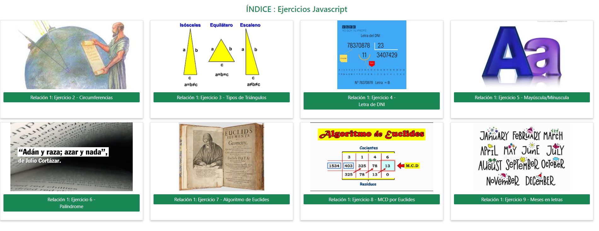

<h1>Abstract : 3º Trimester Exercises with Javascript for Markup Language - 1st Year DAW (Web Application Development)</h1>
<h2>My JavaScript</h2>
<h2>Index</h2>
<ul>
  <li><a href="#introduction">Introduction</a></li>
  <li><a href="#motivation">Motivation</a></li>
  <li><a href="#structure">Structure</a></li>
  <li><a href="#pagestyle">Page Styling</a></li>
</ul>

<h2 id="introduction">Introduction</h2>

Project created by Sandra Barbara Pirpamer

Exercices- My JavaScript - Markup Language - Third Term Evaluation

May 2024

 License CC-BY

<h2 id="motivation">Motivation</h2>

A simple overall design is used for all exercises and they correspond to the index inorder to establish consistency and simplicity.

 
<h2 id="structure">Structure</h2>

The index is made of cards each of which represents one of the exercises and the button links directly to the corresponding form. Each form has a link to redirect the user back to the index.

<ul>
  <li>Index.html</li>  
  <li>relacion1_ej2_circulo.html</li>
  <li>relacion1_ej3_triangulos.html</li>
  <li>relacion1_ej4.html</li>
  <li>relacion1_ej5.html</li>
  <li>relacion1_ej6.html</li>
  <li>relacion1_ej7_div-euclides.html</li>
  <li>relacion1_ej8_mcd-euclides.html.html</li>
  <li>relacion1_ej9_Meses.html</li>
</ul>

<h3>Index</h3>

Each of the cards use the same image included in each of the exercise. A green button is used to link each of the cards to the corresponding exercises. All cards are responsive.

<h3>Ejercises 2-9 (listadol.html)</h3>

A consistent colour palette is used for each of the exercises to blend in with the colours of the image used. Each of the forms is responsive.

 

<h2 id="pagestyle">Page Styling</h2>
<h3>My Colour Palette:</h3>
<ul>
  <li>All primary bootstrap colours are used individually in each of the ejercises, except for beige and purple which are custom-made with CSS. </li> 
</ul>

<h3>Font-Families</h3>

No special font families are used. Defaults are used.

<h3>Images</h3>

Eight different images are used in the project which try to depict the purpose of the exercise. All images are free of copy-right and the sources need not be declared.

<h3>Code Snippets</h3>

All coding was self produced, with the use of classnotes.
 

<h3>Bibliography - Sources</h3>
<ul>
  <li>The official webpage for Bootstrap was used for html styling in Bootstrap.</li>
</ul>
